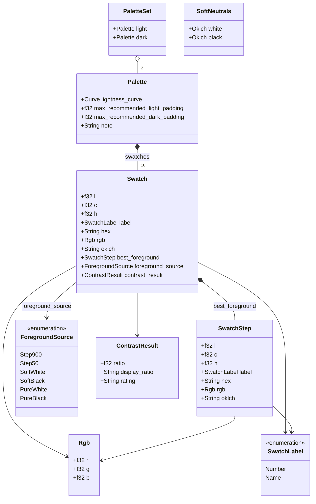

# Harmoni architecture history

Historical reference, not steering for new work. Four refactoring steps were
executed in order C → D → A → B (PRs #1 and #2), followed by a vocabulary
rename and the neutral module.

Reference files — load the one you need:

- `references/refactoring-steps.md` — full narrative of Steps C/D/A/B, the
  vocabulary rename, and Palette's promotion from type alias to struct.
- `references/neutral-module.md` — the neutral module (derive / ramp / tint),
  the six-tier foreground audit, `ForegroundSource`, and the wasm mirror
  types it added.

## The settled rules (the part most sessions need)

- **One parsing path.** `ColorInput` (`crates/harmoni-core/src/color/input.rs`)
  is the only way to hand colours to the engine — variants `Css` / `Rgb` /
  `Hsl` / `Oklch`, all normalising to `palette::Oklch`, the internal
  canonical form. `Css` covers anything `csscolorparser` accepts.
- **Adapters import from `harmoni_core::api` only** — never lower-level
  modules, never the `palette` crate directly. The `api::generate`
  module-and-function name collision is intentional (same pattern as
  `std::mem::size_of`).
- **`harmoni-core` is pure Rust** — exactly three direct deps:
  `csscolorparser`, `palette`, `serde`. All Tsify/wasm-bindgen code lives in
  `crates/harmoni-wasm/src/types.rs` as mirror types with
  `From<harmoni_core::*>` conversions at the boundary.
- **Vocabulary:** `SwatchStep` (one colour point), `SwatchLabel` (numeric or
  named), `Swatch` (one scale item with foreground + contrast metadata),
  `Palette` (a **struct**: `swatches` + `lightness_curve` +
  `max_recommended_*_padding` + `note` — not a `Vec<Swatch>` alias).
- **Primitiv vs Harmoni:** everything Rust/tooling/JS-TS says `harmoni`
  except the deliberate product-name references (README heading,
  `package.json` name, workbench title/`<h1>`). Renaming those erodes the
  identity split — stop.
- **The `neutral` module** supersedes the old `generate_greyscale` —
  `derive_soft_neutrals`, `generate_neutral_ramp`, `tint_neutrals`, all
  wrapped in `api::*` taking `ColorInput`.

## API surface at a glance

The settled public shape, as UML. Source lives in the crate root —
`crates/harmoni-core/api-surface.mmd` (entry points + inputs) and
`crates/harmoni-core/data-model.mmd` (the data model below). Same
capabilities reach Rust adapters via `harmoni_core::api` and TS/JS via
the `harmoni_wasm` `#[wasm_bindgen]` wrapper.

